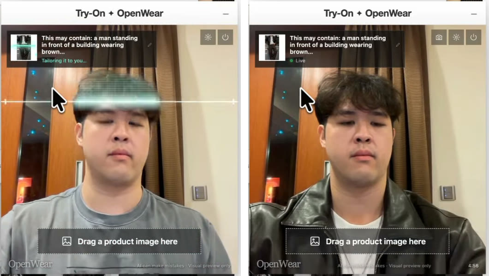

# OpenWear: AI fitting room for your browser

Try on clothes from any online shop (or Pinterest), live on your webcam. Drag a product photo onto yourself and a laser scan swaps the outfit in seconds.



*Left: the scan runs while Decart applies the outfit. Right: a few seconds later, live. Frames from [the reel](https://www.instagram.com/p/Dds3eE4qyK8/).*

Runs on [Decart](https://platform.decart.ai)'s Lucy VTON realtime model. **You just need a Decart API key.**

> 💸 Decart bills live video per second from your credits. Sessions stop when you close the window, switch tabs, or reach the time limit (5 minutes by default).

## Setup (no coding)

1. Get an API key at [platform.decart.ai](https://platform.decart.ai) (starts with `dct_`) and add credits.
2. On this GitHub page click **Code → Download ZIP**, then unzip it.
3. Open `chrome://extensions` (or `brave://extensions`) and turn on **Developer mode** (top right).
4. Click **Load unpacked** and pick the **`openwear-extension`** folder.
5. Paste your key in the settings page that opens, then click **Save key**.

## Use it

1. On any shop, click **AI fitting room** (right side of the page) → **Enable camera**.
2. Line your head and shoulders up with the outline, or click **Skip guide**.
3. Drag a product photo onto the video. Drag another to switch outfits.

**Not showing?** Refresh the page, or use the toolbar icon → **Open fitting room**.

## Build your own version

You need [Node.js](https://nodejs.org) 20+ (the LTS version).

```bash
cd extension
npm ci            # install dependencies (once)
npm run build     # build into extension/build/chrome-mv3-prod
npm test          # run the checks
```

Load `extension/build/chrome-mv3-prod` with **Load unpacked**. After you change code, run `npm run build` again and click ↻ on the extension card.

| File | What it does |
|---|---|
| `extension/content.tsx` | Launcher button and floating window on every site |
| `extension/tabs/room.tsx` | Fitting room: camera, framing guide, Decart session, laser scan |
| `extension/background.ts` | Holds your key, mints short-lived Decart tokens, downloads dragged images |
| `extension/options.tsx` | Settings page |
| `extension/lib/` | Drop handling, prompt building, body tracking |

Your key stays in your browser. Camera video goes to Decart only while the fitting room is open. Body tracking runs on your computer.

[BUSINESS_ANALYSIS.md](BUSINESS_ANALYSIS.md) has my notes on what realtime try-on costs and where a business might work.

MIT licensed.
